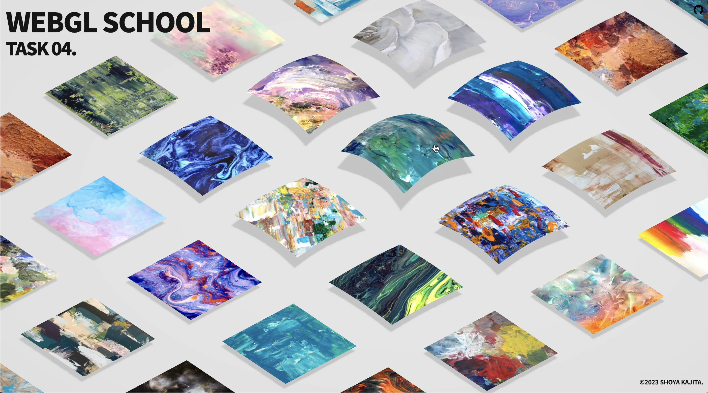
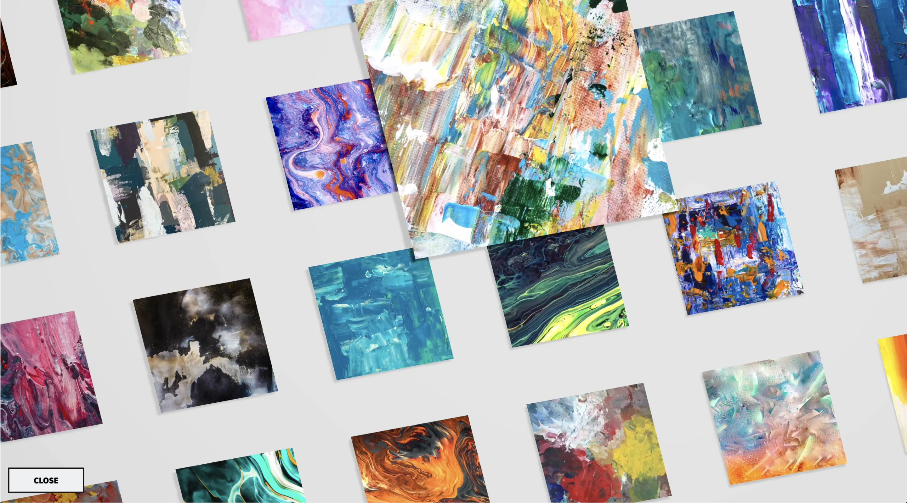
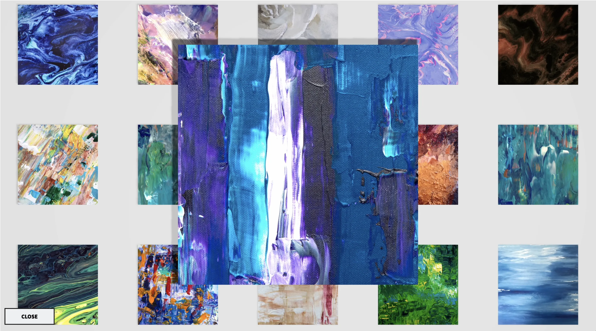

# Task.04 ~ WebGL スクール第 10 期

## 🪬 ~ 要件

- Raycaster と Plane（板）を使ってなにか作ってみましょう。

## 👾 ~ Demo

- https://dev.shoya-kajita.com/020/







## 🎮 ~ Getting Started

- node : v.17.0.0
- npm : 8.1.0

```
// install
npm i

// development
npm run dev

// production
npm run build

// build preview
npm run preview
```

📝 ~ Note
